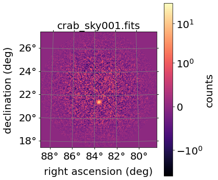
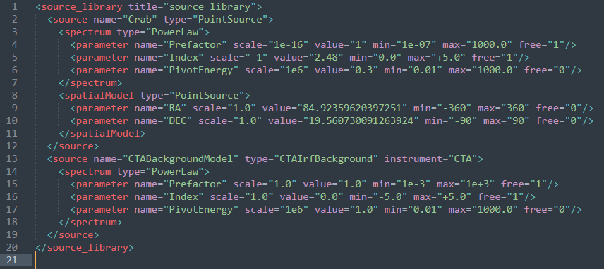

# Gamma-ray images flares
A filtering and clustering system that should identify and extract the centroid of the event, 
the number of photons and other features must be developed. Working with both real and simulated 
gamma-ray sky maps is possible.

## CTA
_Cherenkov Telescope Array_ (CTA) is an initiative to build the next generation of ground-based 
gamma-ray astronomy made by dozens of _Imaging Atmospheric Cherenkov Telescope_ (IACT) that provide 
an unprecedented sensitivity to detect transient events.

The project task concerns of an identification of short-time gamma-ray transients (from seconds to 
hundred seconds), analysing FITS file auto-generated by the simulation procedure given in the software 
package `ctools`. You can check major info in the [user guide](http://cta.irap.omp.eu/ctools/). 
`ctools` comprises a set of ftools-like binary executables and Python scripts with a command-line 
interface that allows the user to interact and perform step-by-step data analysis.

A typical FITS file generated by the simulation procedure is the one shown in the following figure.


Here indeed it is shown a pixelated and smoothed AGILE image of the sky captured by the cta instrument. 
A small blob can be seen the center of the image. It represents the gamma-ray event that must be detected. 

A source model is defined as a collection of parameters in an `XML` file format. Changing the values of the 
`RA` and `DEC` parameters (the source coordinates) implies simulating source at a specific position within 
the map. 



# Quick tutorial
To handle astronomical units, coordinates, and angular separation one can rely on the 
[astropy package](https://www.astropy.org/):  
Other useful library are:
* [Angular separation](https://docs.astropy.org/en/stable/coordinates/matchsep.html)
* [Pixel to world coordinates](https://docs.astropy.org/en/stable/wcs/index.html)

Additionally, the [lxml package](https://lxml.de/) can be used to modify the `XML` model programmatically.

## Environment configuration 
* Download and install [Anaconda](https://docs.anaconda.com/anaconda/install/index.html)
* After the installation install `atropy`:
  ```
  conda create -y -n cta_simulation python=3.7 astropy
  ```
* Activate your new environment
  ```
  source activate cta_simulation
  ```
* Install also ctools from the specified channels
  ```
  conda install -y -c conda-forge -c cta-observatory ctools
  ```

## Notebooks
The repository contains the following notebooks
* `build_dataset` which has the main goal to build your dataset
  **Please be careful**: the following notebook takes a lot of time to cunstruct the all dataset, so I sudgest 
  to you follow these two alternatives:
  - set a very low number of images to test the model
  - follow this [drive link](https://liveunibo-my.sharepoint.com/:f:/g/personal/riccardo_falco2_studio_unibo_it/EicxwPmKRsNOinjKDrp_YgYB4HbqSLsoQWEJJZzEBV3QcA?e=uVDUxP) 
    in order to access to the dataset I used to perform this task
* `cta_project` which contains the training of the model for classification and localization tasks
